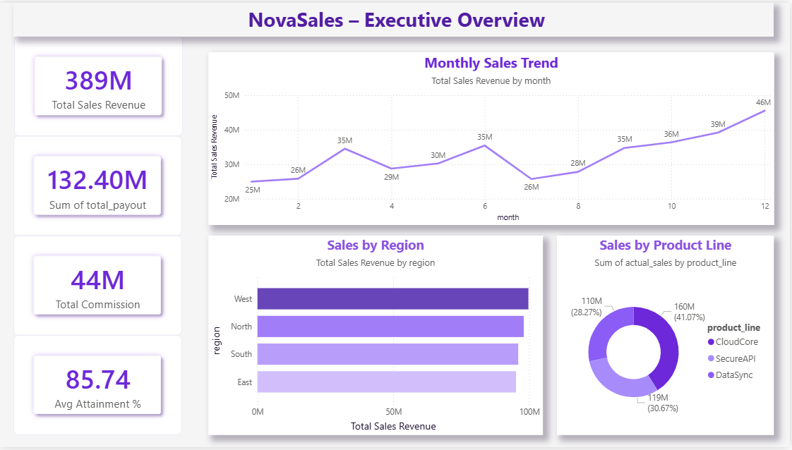
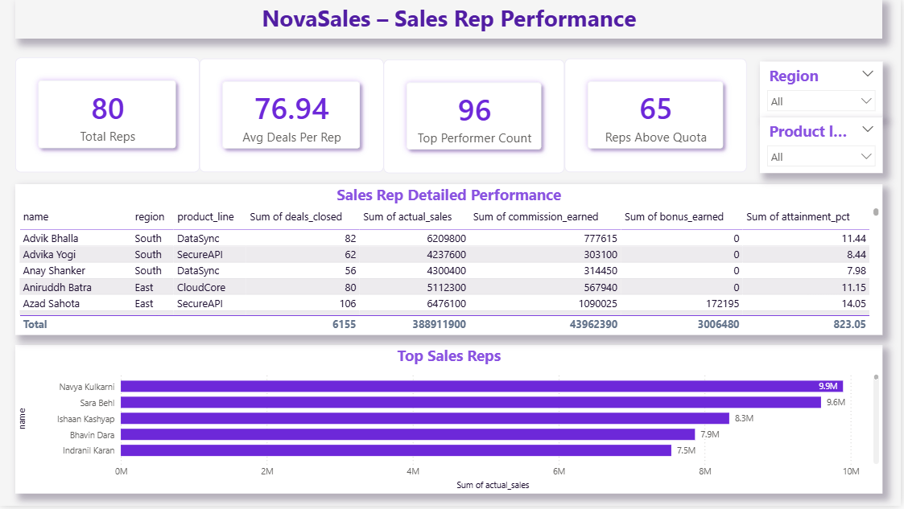
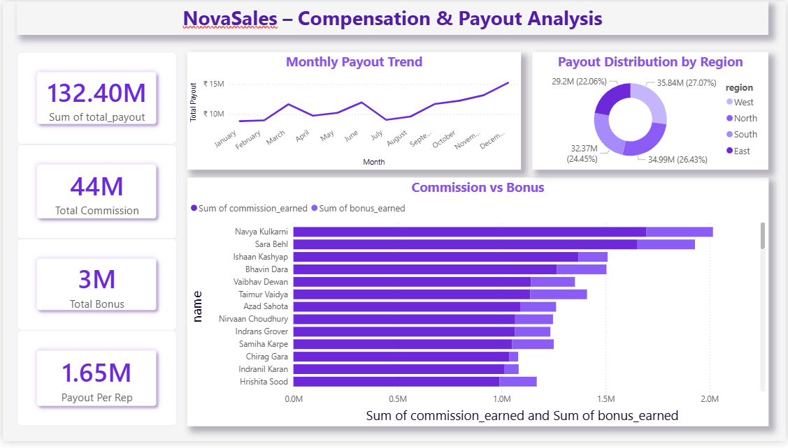

# 💰 NovaSales – Sales Compensation & Incentive Analytics Dashboard

> End-to-end analytics solution for sales compensation, quota tracking, and incentive plan simulation — built with **Python, Streamlit, SQLite & Power BI**.


---

## 📌 Business Problem

**NovaSales Pvt Ltd** (a fictional B2B SaaS company) has **80 sales reps** spread across **4 regions** and **3 product lines**.  
The leadership team needed answers to:

- 💵 How much commission are we paying every month?
- 🎯 How many reps are actually hitting their quota?
- 🏆 Who are our top and bottom performers?
- 📉 What happens to total payout if we tweak the commission slabs?
- 📊 Which region & product line is driving the most revenue?

This project solves all of the above with an **end-to-end analytics pipeline** + **interactive dashboards**.

---

## 🚀 Features

### 🧪 1. Synthetic Data Generation
- 80 sales reps × 12 months = **960 rows** of realistic data
- Includes seasonality, consistent over/under performers
- Generated using **Python + Faker + NumPy**

### 💰 2. Commission Calculation Engine
Slab-based logic:

| Quota Attainment | Commission Rate |
|------------------|-----------------|
| 0% – 50%         | 0%              |
| 51% – 80%        | 5%              |
| 81% – 100%       | 10%             |
| 101% – 120%      | 15%             |
| 120%+            | 20% (Accelerator) |

➕ **Top 10% performers** get an additional **5% bonus**

### 📊 3. Streamlit Dashboard (5 Pages)
| Page | Description |
|------|-------------|
| 🏠 Executive Overview | KPIs, top performers, monthly payout trend |
| 👤 Rep Performance Drilldown | Individual rep deep-dive with gauges |
| 🌍 Regional Analysis | Heatmaps, product line breakdown |
| ⚙ Incentive Plan Simulator | "What-if" slab simulator for finance team |
| 📑 Automated Report Generator | Auto Excel report by month + region |

### 📈 4. Power BI Dashboard (3 Pages)
- ⭐ **Star schema:** fact_sales + dim_rep, dim_region, dim_product, dim_date
- 🧮 **18+ DAX Measures**
- 🎨 Conditional formatting on attainment %
- Pages: Executive Overview | Rep Performance | Compensation & Payout

### 🗄 5. SQLite Database
- Star schema design
- Stores all reps, sales, payouts, and dimensions
- Production-ready for queries & joins

---

## 🛠 Tech Stack

**Languages & Libraries:**  
`Python` `Pandas` `NumPy` `Faker` `Plotly` `OpenPyXL`

**Frameworks & Tools:**  
`Streamlit` `Power BI` `DAX` `SQLite` `Git` `GitHub`

---

## 📂 Project Structure

```
Sales-Compensation-Incentive-Dashboard/
│
├── 📁 data/                     # Raw & processed datasets
│   └── novasales.db             # SQLite database
│
├── 📁 notebooks/                # EDA & experimentation notebooks
│
├── 📁 src/                      # Core Python scripts
│   ├── data_generator.py        # Synthetic data generation
│   ├── commission_engine.py     # Slab-based commission logic
│   └── db_setup.py              # SQLite star schema builder
│
├── 📁 streamlit_app/            # Streamlit application
│   ├── app.py                   # Main entry point
│   └── pages/                   # 5 dashboard pages
│
├── 📁 powerbi/                  # Power BI assets
│   ├── NovaSales_Dashboard.pbix
│   ├── DAX_Measures.md
│   ├── forma_theme.json
│   └── 📁 screenshots/
│
├── 📁 assets/                   # Images, logos, icons
├── .gitignore
├── requirements.txt
├── setup.py
└── README.md
```

---

## ⚡ Quick Start

### 1️⃣ Clone the repo
```bash
git clone https://github.com/Nainilshah04/Sales-Compensation-Incentive-Dashboard.git
cd Sales-Compensation-Incentive-Dashboard
```

### 2️⃣ Install dependencies
```bash
pip install -r requirements.txt
```

### 3️⃣ Generate data + setup database
```bash
python setup.py
```

### 4️⃣ Run the Streamlit app
```bash
streamlit run streamlit_app/app.py
```

### 5️⃣ Open the Power BI dashboard
Open `powerbi/NovaSales_Dashboard.pbix` in **Power BI Desktop**

---

## 📊 Power BI Dashboard Screenshots

### 1️⃣ Executive Overview


### 2️⃣ Sales Rep Performance


### 3️⃣ Compensation & Payout Analysis


📄 [View Full PDF Report](powerbi/screenshots/NovaSales_Dashboard.pdf)

---

## 🧮 Key Power BI DAX Measures

```dax
Total Payout = SUM(commission_data[total_payout])

Avg Attainment % = AVERAGE(commission_data[attainment_pct])

Reps Above Quota = 
CALCULATE(
    DISTINCTCOUNT(commission_data[rep_id]),
    commission_data[attainment_pct] >= 1
)

MoM Payout % = 
VAR PrevMonth = CALCULATE([Total Payout], PREVIOUSMONTH(commission_data[month]))
RETURN DIVIDE([Total Payout] - PrevMonth, PrevMonth)
```

📌 Full list available in [`powerbi/DAX_Measures.md`](powerbi/DAX_Measures.md)

---

## 🎯 Key Insights Delivered

✅ Identified top 10% performers driving **40%+ of total revenue**  
✅ Quantified payout impact of slab changes via **what-if simulator**  
✅ Spotted **at-risk reps** consistently below 60% attainment  
✅ Highlighted **regional imbalances** in quota achievement  
✅ Automated monthly **Excel reporting** for finance team  

---

## 💡 What I Learned

- Designing **star schema** databases for analytics
- Building **slab-based business logic** in Python
- Creating **interactive dashboards** with Streamlit & Plotly
- Writing optimized **DAX measures** in Power BI
- End-to-end project structuring & **GitHub deployment**

---

## 📬 Contact

👨‍💻 **Nainil Shah**  
📧 nainilshah04@gmail.com  
🔗 [GitHub](https://github.com/Nainilshah04)

---

## 📜 License

This project is licensed under the **MIT License** — free to use for learning and portfolio purposes.

---

⭐ **If you found this project helpful, give it a star on GitHub!** ⭐